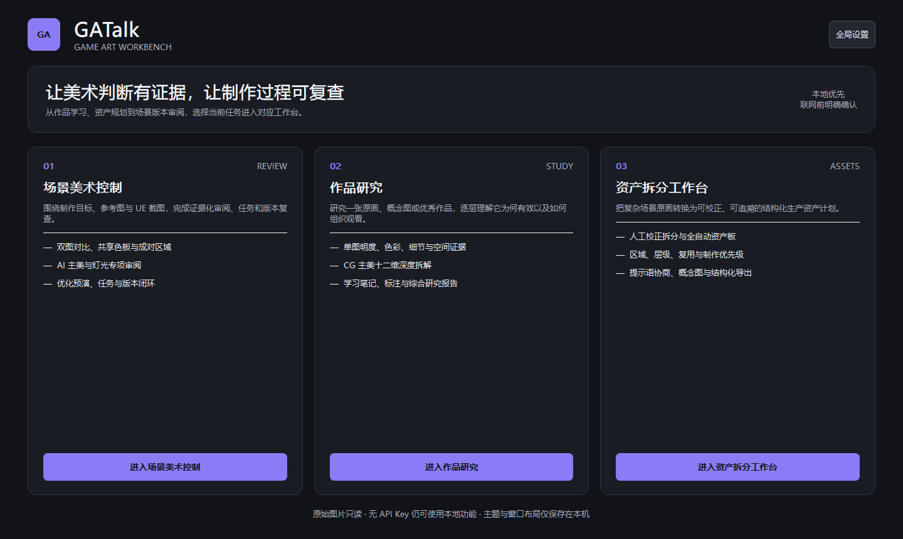
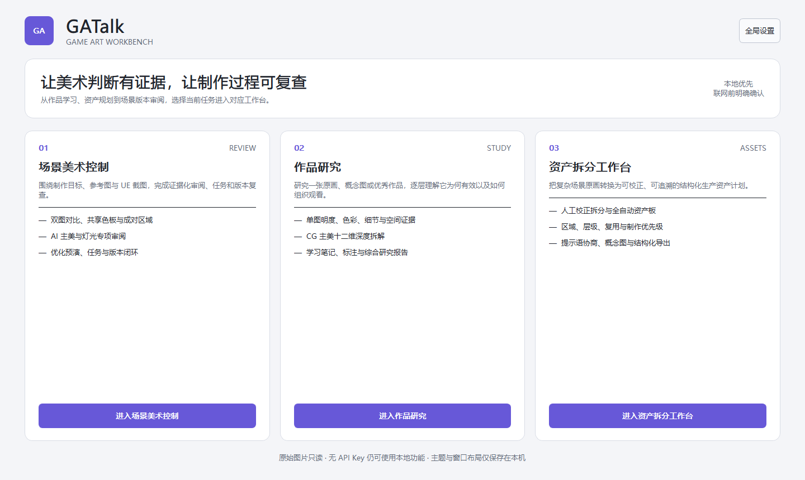

# GATalk

GATalk 是 Windows 本地游戏美术工作台。启动后可选择：

- **场景美术控制**：参考图、UE 截图、证据化审阅、任务、优化预演和版本复查。
- **作品研究**：对一张原画、概念图或优秀场景作品进行本地证据观察、CG 主美
  十二维拆解和个人学习记录。
- **资产拆分工作台**：把复杂场景原画整理为可校正的资产清单、原图区域、
  模块关系、制作优先级、独立概念图和资产展示板。

原图始终只读。没有 API Key 时，本地测量、项目/研究保存和离线 Mock 流程仍可
使用；真实网络发送只在用户查看清单并确认后发生。

GATalk 是一款面向游戏场景美术、UE 地编和环境艺术作品的 Windows
本地游戏场景美术控制工作台。它将制作目标、参考图、当前截图、证据测量、
AI 专项审阅、修改任务、优化预演、新版本复查和质量门禁串成可追踪的工作流。

M0.5、M1A、M1B.1 和 M1B.2 已通过真实项目人工验收并冻结。当前 `0.10.0`
为 **GATalk 品牌与界面更新版**：正式产品名改为 GATalk，增加全局主题、
强调色、字号、控件密度和工作台布局设置，并统一三个工作台的现代化视觉层级。
原 SceneLens 项目、最近项目记录和 Windows 系统凭据继续兼容。

## 环境要求

- Windows 10/11 x64
- Python 3.11 x64
- 首次安装依赖时需要网络连接

## 一键启动

双击根目录下的 `start_dev.cmd`。脚本会：

1. 检查 Python 3.11 x64；
2. 在项目目录创建 `.venv`；
3. 安装锁定的开发依赖；
4. 启动 GATalk。

命令行启动方式：

```powershell
.\start_dev.cmd
```

## 使用

请阅读 [USER_GUIDE.md](USER_GUIDE.md)。它随每次用户可见更新同步维护。

场景控制：新建项目 → 填写制作意图 → 新建 Shot → 导入参考图与当前截图 →
查看证据 → AI 审阅 → 任务 → 新 Version 复查。

作品研究：新建研究 → 导入一张作品 → 查看本地证据 → AI 十二维拆解 →
个人学习笔记 → 保存。

资产拆分：新建资产项目 → 导入场景原画与补充参考 → 选择可校正拆分、
全自动资产板或资产拆分提示语 → 保存、生成或复制结果。

## 测试

```powershell
.\scripts\test.ps1
```

## 构建 Windows Alpha

```powershell
.\build_alpha.cmd
```

输出目录为 `dist/GATalk/`。这是 PyInstaller `onedir` 目录，不需要目标
电脑预装 Python。

`pyproject.toml` 固定直接依赖；`requirements-lock.txt` 保存本轮已验证环境的
完整版本快照。

## 界面预览





## 文档

- [USER_GUIDE.md](USER_GUIDE.md)：简明中文使用手册
- [PROJECT_BRIEF.md](PROJECT_BRIEF.md)：产品目标与范围
- [DECISIONS.md](DECISIONS.md)：已接受的产品与技术决策
- [ROADMAP.md](ROADMAP.md)：开发阶段与验收标准
- [THIRD_PARTY_LICENSES.md](THIRD_PARTY_LICENSES.md)：依赖与许可证记录
- [AGENTS.md](AGENTS.md)：持续开发规则
- [M0.5_VALIDATION.md](M0.5_VALIDATION.md)：技术验证结果
- [M1A_VALIDATION.md](M1A_VALIDATION.md)：M1A 工程验证与人工试用步骤
- [M1B.2_VALIDATION.md](M1B.2_VALIDATION.md)：M1B.2 自动验证与人工试用步骤
- [docs/M1_DATA_MODEL.md](docs/M1_DATA_MODEL.md)：M1 数据结构与迁移方案
- [docs/M2_DATA_MODEL.md](docs/M2_DATA_MODEL.md)：M2 共享核心与 schema v5
- [docs/M2_PROVIDER_ARCHITECTURE.md](docs/M2_PROVIDER_ARCHITECTURE.md)：
  Provider 接口、完成度和未验证项
- [docs/PROVIDER_COMPATIBILITY_AUDIT_2026-07-19.md](docs/PROVIDER_COMPATIBILITY_AUDIT_2026-07-19.md)：
  AI 接口兼容修复、错误含义和人工联网验证项
- [docs/COMPETITOR_REVIEW_M2.md](docs/COMPETITOR_REVIEW_M2.md)：M2 竞品审查
- [docs/M4_DEEP_REVIEW_ARCHITECTURE.md](docs/M4_DEEP_REVIEW_ARCHITECTURE.md)：
  八维审阅、证据校验与构图辅助边界
- [docs/ASSET_BREAKDOWN_RESEARCH_2026-07-30.md](docs/ASSET_BREAKDOWN_RESEARCH_2026-07-30.md)：
  资产识别、分割、补全、视图重建和商业工具调研
- [docs/ASSET_BREAKDOWN_ARCHITECTURE.md](docs/ASSET_BREAKDOWN_ARCHITECTURE.md)：
  资产拆分模块、数据模型、Provider 与真实性边界
- [docs/GATALK_UI_SETTINGS_RESEARCH_2026-07-31.md](docs/GATALK_UI_SETTINGS_RESEARCH_2026-07-31.md)：
  GATalk 界面、主题和设置方案调研
- [GATALK_UI_SETTINGS_VALIDATION.md](GATALK_UI_SETTINGS_VALIDATION.md)：
  自动化测试、渲染检查、打包结果和人工试用步骤
- [M6_ASSET_BREAKDOWN_VALIDATION.md](M6_ASSET_BREAKDOWN_VALIDATION.md)：
  自动验证、限制和人工试用步骤
- [docs/M1B2_REGION_DATA_MODEL.md](docs/M1B2_REGION_DATA_MODEL.md)：区域 schema 与 Version 语义
