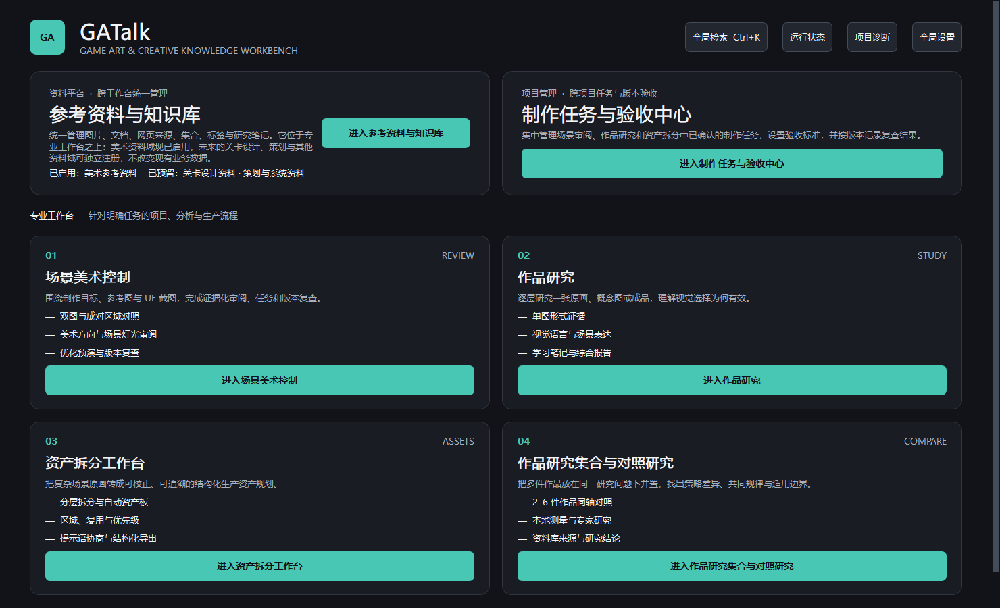

# GATalk

GATalk 是一款面向游戏环境美术与场景制作的桌面工具，将参考图分析、视觉对比、作品研究、场景审阅和资产拆分整合到统一工作流中，帮助创作者更清晰地理解画面、整理制作依据，并将分析结果转化为可执行的美术任务。

> 当前状态：`0.18.1 Beta 1`。项目仍处于公开测试阶段，界面、项目格式和 AI
> 供应商兼容性可能继续调整。请在重要项目中保留独立备份。

[English](README_EN.md) · [简明图文手册](USER_GUIDE.md) · [路线图](docs/PUBLIC_ROADMAP.md) · [参与贡献](CONTRIBUTING.md) · [安全说明](SECURITY.md)

## 普通用户下载（Windows x64）

**[下载 GATalk 0.18.1 Beta 1 Windows 测试版](https://github.com/WrayMark/GATalk/releases/download/v0.18.1-beta.1/GATalk-0.18.1-beta.1-windows-x64.zip)**

> GitHub 的绿色 **Code → Download ZIP** 下载的是源代码，不包含可运行的 EXE。
> 普通用户应下载上面的 Windows 发布包。

完整解压后运行 `GATalk/GATalk.exe`。目标电脑不需要预装 Python。程序尚未签名；
首次启动前可在 [Release 页面](https://github.com/WrayMark/GATalk/releases/tag/v0.18.1-beta.1)
核对 SHA-256 和已知限制。



## 适用对象

GATalk 主要面向游戏环境美术、场景制作、UE 地编、概念设计与相关学习者。它适合
整理视觉证据和制作决策，不替代主美判断、版权审查或 UE 工程内性能分析。

## 已实现功能

- **场景美术控制**：制作意图、参考图与截图对比、色板与明度证据、配对区域、
  专项审阅、任务和版本复查。
- **作品研究**：对单张原画、概念图或场景作品进行本地测量、结构化解读和学习记录。
- **作品研究集合与对照研究**：并置 2–6 件作品，按同一研究问题比较构图、明度、
  色彩、灯光与空间关系。
- **资产拆分工作台**：场景理解、可校正资产清单、拆分层级、自动资产板和生成提示语。
- **参考资料与知识库**：管理图片、文章链接、标签、局部摘录、笔记和跨项目引用。
- **制作任务与验收中心**：汇总已确认结论，记录验收条件、版本复查和质量门禁。
- **多语言与外观**：简体中文基准界面，以及繁中、英语、日语、法语预览；深色、
  浅色和跟随系统主题。

## 当前限制

- 仅提供 Windows x64 测试版；未签名，首次启动可能出现 Windows SmartScreen 提示。
- 简体中文是基准语言；其他语言仍需母语审校。
- OpenAI、Gemini、Claude、Qwen 等真实 AI 调用需要用户自己的账号、API Key、额度和
  所在地区可用性；供应商模型与接口可能在软件发布后变化。
- 离线 Mock 只验证流程与结构，不是本地视觉模型，也不会给出真实图像语义判断。
- AI 结果可能出错；证据、推断与生成补全会分开记录，但最终结论仍需用户核对。
- 暂不包含生产可用 3D 生成、UE 工程扫描、视频分析、本地大型模型或 CUDA 流程。

## 数据与隐私

- 项目和导入资料默认保存在用户选择的本地目录；原始图片只读，不会被覆盖。
- 软件不会后台上传图片，也不包含遥测或自动更新服务。
- 每次联网发送必须由用户主动触发，并在发送前显示数据清单。
- API Key 可保存到 Windows Credential Manager，不写入项目、SQLite、JSON 或日志。
- 导出给外部 AI 前可移除 EXIF、ICC、本地路径等元数据并限制图片尺寸。

详见 [SECURITY.md](SECURITY.md) 与 [隐私和联网边界](docs/PRIVACY.md)。

## 从源码运行

要求：Windows 10/11 x64、Python 3.11 x64、Git。首次安装依赖需要联网。

```powershell
git clone https://github.com/WrayMark/GATalk.git
cd GATalk
.\start_dev.cmd
```

脚本会在仓库内创建 `.venv`、安装固定版本依赖并启动应用。API Key 不应写入 `.env`
或源码；请在应用内存入 Windows Credential Manager。

手动安装：

```powershell
py -3.11 -m venv .venv
.\.venv\Scripts\python.exe -m pip install -e ".[dev]"
.\.venv\Scripts\python.exe -m scenelens
```

## 测试与构建

```powershell
.\scripts\test.ps1
.\build_alpha.cmd
.\scripts\windows-acceptance.ps1
powershell -NoProfile -ExecutionPolicy Bypass -File .\scripts\build_release_bundle.ps1
```

构建输出位于 `dist/GATalk/`。公开 Release 还需运行安全审计、第三方通知收集和发布包
校验，步骤见 [发布检查表](docs/RELEASE_CHECKLIST.md)。

## 项目结构

```text
src/scenelens/       应用外壳、共享核心和业务模块
tests/               离线单元、存储、UI 与契约测试
docs/                架构、调研、验证与公共文档
scripts/             开发、测试、打包、截图和审计脚本
```

`scenelens` 是项目早期名称，现保留为 Python 包名、模块 ID 与旧项目兼容标识；产品、
可执行程序和公开项目统一使用 **GATalk**。兼容层会继续读取旧的 SceneLens 项目和凭据
名称，文档不会把它作为对外产品名。

## 参与与许可

提交问题前请阅读 [CONTRIBUTING.md](CONTRIBUTING.md)。安全问题不要建立公开 Issue，
请按 [SECURITY.md](SECURITY.md) 使用 GitHub 私密漏洞报告。

GATalk 源码采用 [MIT License](LICENSE)。Windows 二进制包含按各自许可证分发的
第三方组件，尤其是 LGPLv3 的 Qt for Python；完整声明与对应源码说明见
[THIRD_PARTY_LICENSES.md](THIRD_PARTY_LICENSES.md) 和发行包内的
`THIRD_PARTY_NOTICES.txt`。
