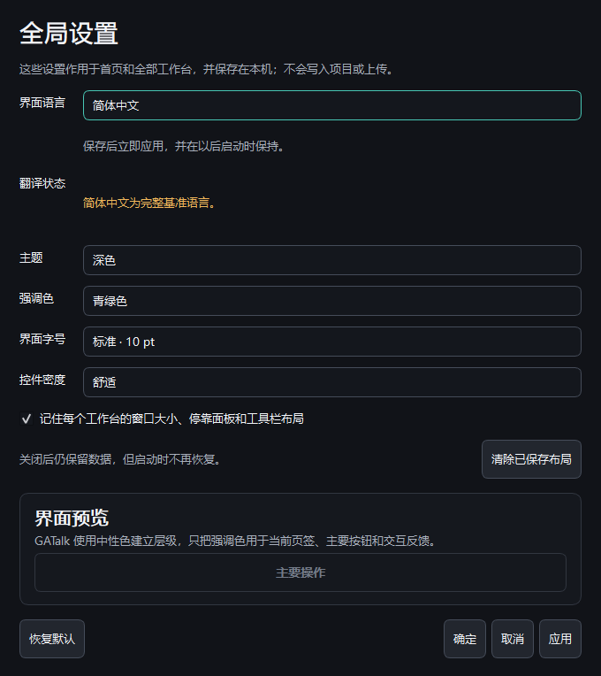
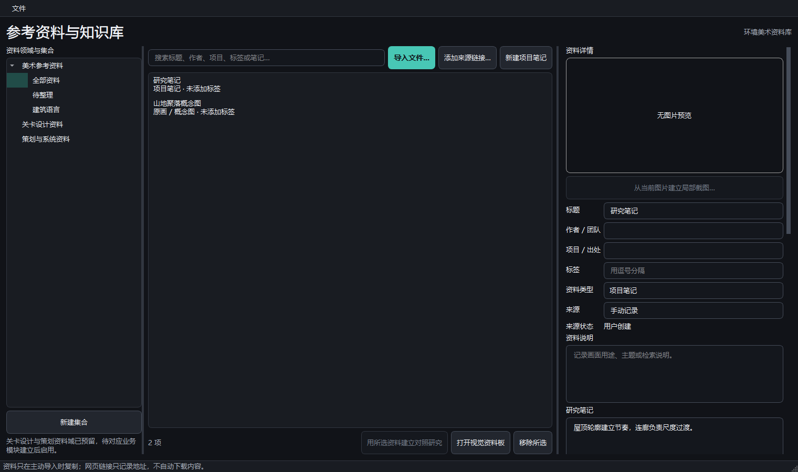
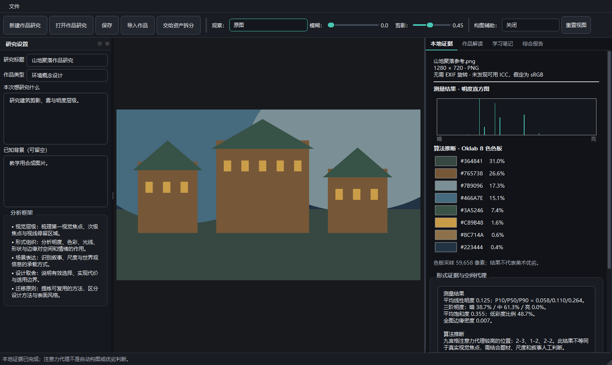
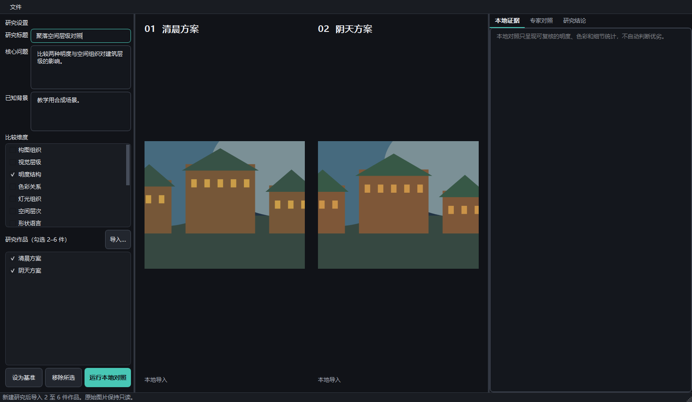
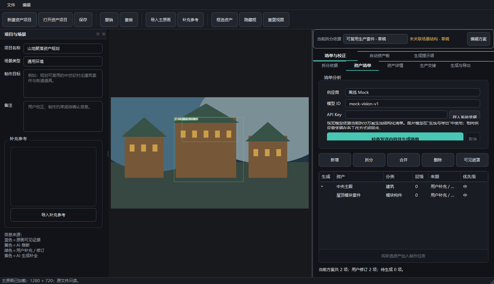
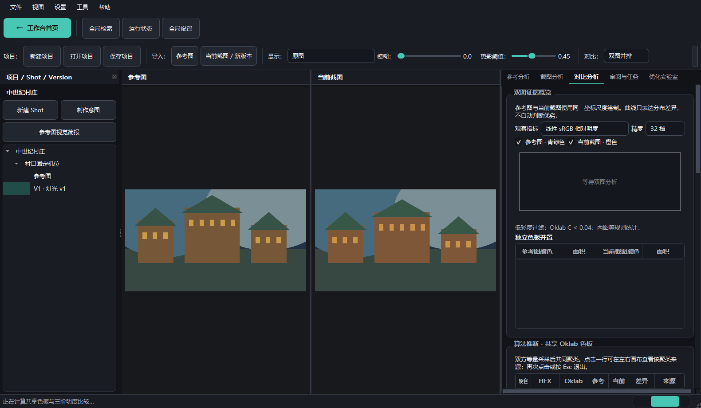
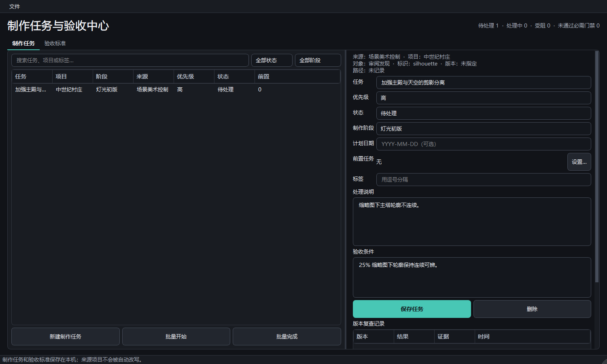

# GATalk Illustrated Quick Guide

Version: `0.18.1 Beta 1`; updated: 2026-08-14

This guide covers the common workflow in short steps. Button names follow the English UI.

## 1. Start

Purpose: open a platform or professional workbench from one home screen.

1. Download the Windows x64 beta from GitHub Releases and extract the complete archive.
   Do not use **Code → Download ZIP**; that button downloads source code without a runnable EXE.
2. Run `GATalk/GATalk.exe`; developers can run `start_dev.cmd`.
3. Select a workbench. Recent projects appear below.
4. Press `Ctrl+Shift+H` in any workbench to return Home.

Result: GATalk preserves the current window size and maximized state. Imported images remain read-only, and nothing is uploaded automatically.

The beta is not code-signed. If Windows displays a protection warning, verify the archive SHA-256 on the Release page before continuing.

## 2. Global Settings

1. Press `Ctrl+,`, or choose **Settings > Global Settings**.
2. Select language, theme, font size, and UI density.
3. Choose **Apply** to preview and **OK** to save.

Saved settings remain active on the next launch. Language changes never rewrite project names, notes, or earlier AI results.

Shortcuts: `Ctrl+K` Search; `Ctrl+Z` Undo; `Ctrl+Shift+Z` Redo; `Esc` exit the current tool.

## 3. References & Knowledge Base

Purpose: store reusable images, articles, links, and project notes.

1. Create or open a library.
2. Create collections and import files, links, or notes.
3. Add author, source, tags, and research notes, then save.
4. Create a crop, translate selected text, or reference the item from a project.

Web links are stored but never fetched automatically. Translation and online analysis require explicit confirmation.

## 4. Artwork Study

Purpose: study composition, value, colour, light, space, and visual storytelling in one artwork.

1. Create a study and import an image.
2. Enter the research goal and known context; leave uncertain facts blank.
3. Inspect **Local Evidence**, then explicitly start **Expert Analysis**.
4. Record your own conclusions in **Learning Notes**.

Local measurements and AI interpretation are stored separately.

## 5. Comparative Study

Purpose: compare two to six artworks under one research question.

1. Create a study and import the artworks.
2. Select axes such as composition, value, or colour organisation.
3. Compare the images side by side and record shared patterns and key differences.

## 6. Asset Breakdown

Purpose: turn complex concept art into an editable asset plan, generation prompts, and asset boards.

1. Create a project and import the main artwork and optional references.
2. Complete scene understanding, then select breakdown depth and production goal.
3. Correct asset names, hierarchy, categories, and source regions.
4. Generate only selected assets, or prepare prompts for an external image tool.
5. Export the asset list, images, or board.

Visible evidence, AI inference, and generated completion are labelled separately. Generated images are concept aids, not production-ready models.

## 7. Scene Art Control

Purpose: compare production intent, reference art, and the current UE screenshot.

1. Create a project and complete **Production Intent**.
2. Create a Shot; import a reference and the current Version.
3. Compare the canvases and inspect palette, value, and paired-region evidence.
4. Review the send manifest before starting an AI review.
5. Convert confirmed findings into tasks and verify them against a new Version.

Projects restore the active Shot, Version, view, parameters, and analysis history.

## 8. Production Tasks & Acceptance

1. Confirm a finding in its source workbench and create a task.
2. Filter tasks by project, stage, priority, or status.
3. Add acceptance criteria and record Passed, Failed, or Insufficient Evidence on a new version.

The centre stores cross-project indexes and acceptance records; it never rewrites source projects.

## 9. AI and safety

1. Select a provider and model. API keys are stored only in Windows Credential Manager.
2. Inspect images, fields, resolution, and expected calls before sending.
3. For `401/403`, check credentials and access; for `404`, check the model ID; for `429`, wait for quota; for `503`, retry later.
4. Offline Mock validates workflow and structure only. It is not a local vision model.

Without an API key, projects, measurements, regions, tasks, reports, and offline review packages remain available. Every network request requires a user action.

## 10. Report an issue

Purpose: provide a reproducible report without publishing private or commercial data.

1. Confirm the defect in the latest GitHub beta and provide the version, Windows release, display scaling, and reproduction steps.
2. Use a synthetic or redistributable image. Remove API keys, private paths, accounts, and project secrets.
3. Use a GitHub Issue for ordinary defects. Use private vulnerability reporting for credential exposure, unsafe file access, or another security defect.

Result: maintainers receive a minimal reproduction, while public records remain safe to redistribute.
